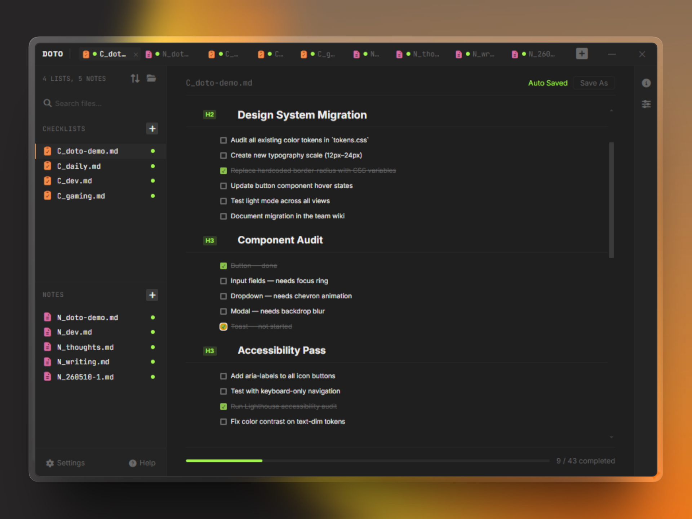
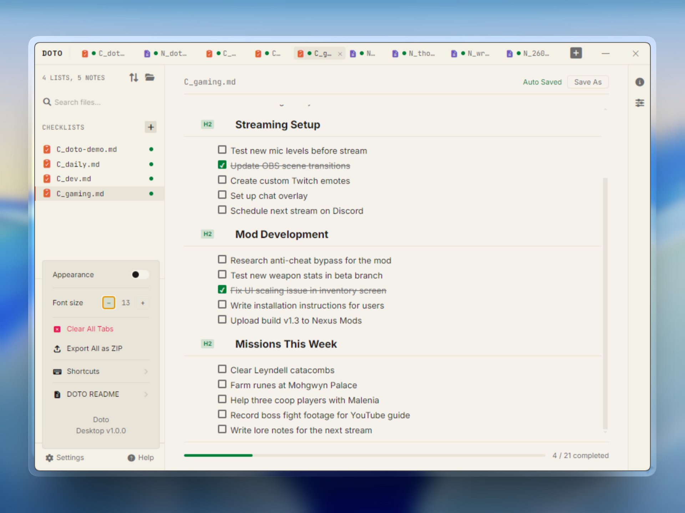
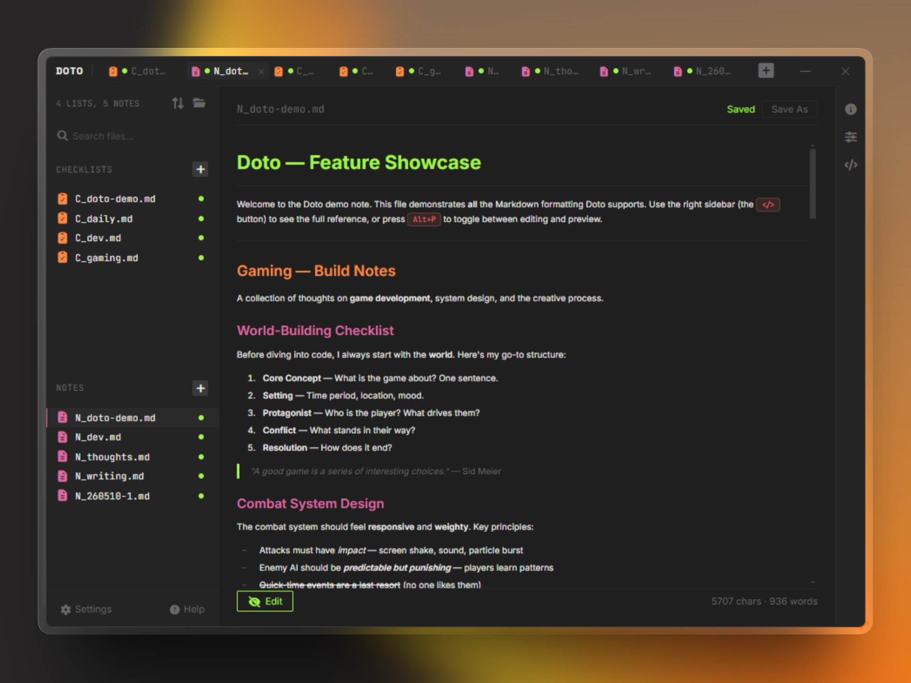
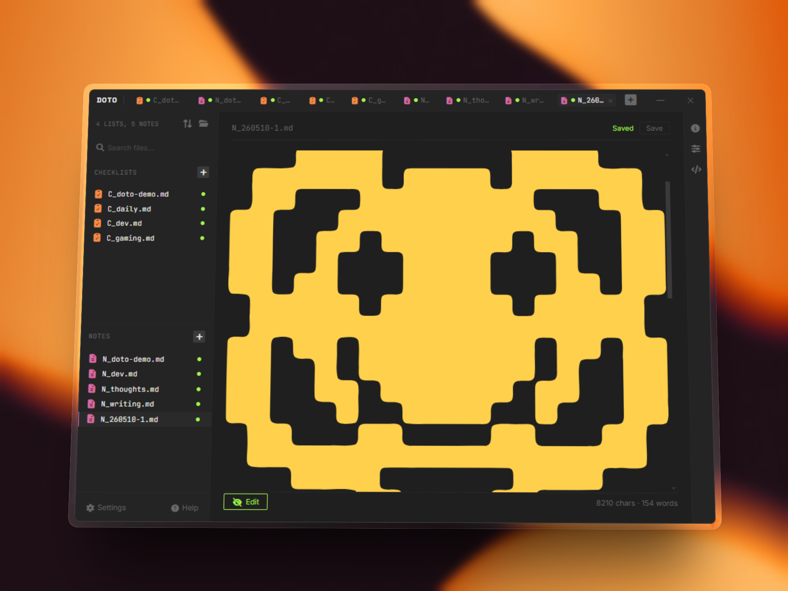

<div align="center">
  

# Doto

**Tick it off.**

[](package.json)
[](#license)
[](https://www.electronjs.org/)
[](https://vuejs.org/)
[](src/composables/__tests__)
[](#)
[](#)
[](#)
[](#)
[](#)

  <br>

**A dedicated checklist window for Windows. Plain Markdown files. Zero setup.**

Type. Check off. Save to `.md`. No accounts. No browser. No lock-in.

  <br>

  <a href="#download">
    
  </a>

<sub> · 30-second install · no sign-up · free & open source</sub>

</div>

---

## Screenshots

<div align="center">


  <br>
  <em>Bidirectional sync between VS Code (or any code editor) and DOTO view</em>
  <br><br>


  
  <br>
  <em>Checklist with headings, progress bar, and drag-and-drop reorder</em>

<br>


  <br>
  <em>Checklist with headings, progress bar, and drag-and-drop reorder</em>

  <br><br>

  
  <br>
  <em>Notes with live Markdown preview, toggleable via Alt+P</em>

<br><br>

  
  <br>
  <em>Supported SVG code preview</em>
  <br><br>
</div>


---

## Download

Get the latest installer from the [Releases](https://github.com/YOUR_USERNAME/doto/releases) page:

- **Doto Setup 1.0.0.exe** — Windows installer
- No admin required
- Portable version also included in each release (no install needed)

---

## Why Doto? Compared to every alternative.

|                             | Notion         | Todoist     | VS Code extension | Doto |
| --------------------------- | -------------- | ----------- | ----------------- | ---- |
| **Dedicated window**        | ❌ Browser tab | ✅          | ❌ IDE sidebar    | ✅   |
| **Works offline**           | ❌             | ⚠️ Limited  | ✅                | ✅   |
| **Plain .md files on disk** | ❌             | ❌          | ✅                | ✅   |
| **Editor-independent**      | ❌             | ❌          | ❌ (VS Code only) | ✅   |
| **Keyboard-first**          | ⚠️             | ✅          | ✅                | ✅   |
| **Visual checkboxes**       | ✅             | ✅          | ✅                | ✅   |
| **Notes + Lists**           | ✅             | ❌          | ❌                | ✅   |
| **Free & open source**      | ❌             | ⚠️ Freemium | ✅                | ✅   |
| **No account required**     | ❌             | ❌          | ✅                | ✅   |
| **Bidirectional sync**      | ❌             | ❌          | N/A               | ✅   |

**Doto doesn't replace Notion or Todoist.** It replaces what you use when you just need a checklist next to your code — without opening a browser, without signing in, without leaving your keyboard.

---

## The Problem

You have your code in Git. Your tasks scattered across different apps. Your checklists locked inside proprietary web apps or cloud services. **What you're missing: a proper checklist app that lives in the same folder as your code.**

### Every option compromises

- **Notion** — Best checklist UX. But it's a browser tab. Your tasks stay inside Notion — you can't open them in your project folder next to your code. Requires an account. Requires internet.
- **Todoist / Microsoft To Do** — Proprietary formats. Cloud-dependent. Your data lives on their servers. No plain `.md` file ever lands on your disk.
- **VS Code extensions** — They work inside your editor, which is fine until you switch to Sublime, Vim, or Cursor. Now your checklists are stuck in VS Code. They also can't live in their own window.
- **GitHub Issues / Jira** — Overkill for personal task tracking. Requires internet. Requires a browser.
- **Obsidian / Joplin** — Local files and open formats, but designed for knowledge management. Sidebars, plugins, vaults, configuration. Too much app for a simple checklist.
- **Plain text editors** — You _can_ edit `- [ ]` manually, but there's no visual checkbox, no one-click toggle, no keyboard shortcuts.

**Doto is different.** One window. Plain Markdown files on your disk. Edit in any editor. Commit to Git. No accounts. No setup.

---

## Why a Dedicated Desktop App

Task management deserves its own window, not a sidebar in your IDE.

- **Always one click away** — Click the taskbar icon, start typing. No need to open VS Code or any IDE.
- **Works with every editor** — VS Code, Sublime, Vim, Cursor, Emacs, Notepad — edit your checklist in whatever tool you prefer. Doto syncs changes instantly.
- **Parallel workflow** — Code editor on one side, Doto on the other. Edit code, check off tasks, repeat. No tab-switching inside your IDE.
- **Editor-independent** — Switch editors tomorrow. Your checklist still works. Not locked into any ecosystem.
- **Distraction-free** — A focused app for task management. Not a panel competing with your code.
- **Always on disk** — No sync delays, no cloud dependency. Your file is right there in your project folder.

---

## How Doto Works

### ✓ Real Bidirectional Sync

Edit your checklists in Doto or **any text editor**. Changes flow both ways.

```
Your Workflow:
  Doto (visual checkboxes)  ↔  Auto-sync  ↔  Your .md file in Git
           ↓                                         ↓
   VS Code / Sublime / Vim / Cursor / Any text editor
```

- **Edit in Doto** — Click checkbox, progress updates, file saves to disk
- **Edit externally** — Return to Doto, changes load instantly
- **Conflict?** Smart dialog: Overwrite, Reload from file, or Cancel
- **Non-destructive** — Unrecognized Markdown is preserved verbatim
- **Standard format** — GFM task syntax (`- [ ]` / `- [x]`). Same format GitHub uses

### ✓ Lightning-Fast Task Organization

**Adding headings:**

- **Hover + Click** — `+` icon appears near any task, click to add heading below
- **Ctrl+Click** — Add heading above the current task
- **Keyboard** — `Alt+B` (below) / `Alt+A` (above)

**Reordering:**

- **Drag and drop** — Grab any task or heading by the handle, rearrange instantly
- **Promote/Demote** — `Tab` / `Shift+Tab` for heading levels
- **Visual feedback** — Drop indicator line shows exactly where it lands

**Managing items:**

- **Enter** — Add item below
- **Ctrl+Enter** — Toggle done/undone
- **Backspace/Delete** on empty — Remove item

### ✓ Notes Alongside Tasks

- Plain text editor with live Markdown preview (`Alt+P` to toggle)
- Supports: bold, italic, strikethrough, links, code, headings, bullet lists, **numbered lists**, blockquotes, tables, checkboxes, code blocks
- Lock mode for distraction-free reading
- Character and word count

### ✓ Your Data, Your Format, Your Control

```markdown
# Sprint 15

- [ ] Fix authentication bug
- [x] Review PR #142
- [ ] Write unit tests for payment flow
```

Plain Markdown. Commit to Git. Open in any editor. Forever yours.

---

## Features

| Category       | Details                                                                                                                                       |
| -------------- | --------------------------------------------------------------------------------------------------------------------------------------------- |
| **Checklists** | H2–H6 headings, drag-and-drop reorder, promote/demote headings, progress bar, undo/redo (50 levels), bulk select, font size scaling (10–24px) |
| **Notes**      | Markdown editor + live preview, numbered lists, lock mode, character/word count, `Alt+P` toggle                                               |
| **Tabs**       | Multiple files open simultaneously, duplicate, pin/unpin, close with save prompt                                                              |
| **Sync**       | Bidirectional with any text editor. Conflict dialog on save. Non-destructive parser preserves unrecognized Markdown                           |
| **Sidebar**    | Search, sort (A–Z, Z–A, recent, manual), filter by type                                                                                       |
| **Theme**      | Dark and light mode, persisted across restarts                                                                                                |
| **Export**     | ZIP export of all tabs as `.md` files                                                                                                         |
| **Shortcuts**  | Full keyboard navigation. See `?` in sidebar for reference                                                                                    |

---

## Limitations (honest)

- **Windows only** — No macOS or Linux build yet
- **Single-user, local-first** — No real-time collaboration, no cloud sync
- **Checklist bidirectional sync applies to `C_` files only** — Notes are write-only from app to file
- **No mobile app** — Desktop only
- **No direct import from Todoist/Notion** — Your checklists start fresh (but the `.md` format is universal)

These are conscious trade-offs. Doto is designed for developers who want their checklists in their project folder, not in another cloud silo.

---

## File Format & Compatibility

Doto saves to **GitHub Flavored Markdown (.md)**. Works everywhere:

- **Checklists:** `C_*.md` (recognized by Doto as interactive checklists)
- **Notes:** `N_*.md` (recognized by Doto as editable notes)

Not using Doto anymore? **The file still works.** Open in VS Code, Sublime, GitHub, Obsidian — any Markdown editor. That's the entire point.

---

## For Developers

```bash
git clone https://github.com/YOUR_USERNAME/doto.git
cd doto
npm install
npm run dev              # Terminal 1: Vite dev server
npm run dev:electron     # Terminal 2: Electron app
npm run test             # 86 unit tests
npm run build            # Package as Windows .exe
```

### Build Output

After `npm run build`, you'll find:

- `dist\Doto Setup 1.0.0.exe` — Windows installer
- `dist\win-unpacked\Doto.exe` — Portable app (no install needed)

---

## Architecture

```
Main Process (Electron) ←→ Preload (contextBridge) ←→ Renderer (Vue 3)
     │                                                        │
  File I/O, IPC, ZIP export                        UI components, composables
```

---

## Changelog

See [CHANGELOG.md](CHANGELOG.md) for full release history.

---

## License

MIT License. Free and open-source.

---

## Support & Feedback

- 🐛 [Report Issues](https://github.com/YOUR_USERNAME/doto/issues)
- 💬 [Discussions](https://github.com/YOUR_USERNAME/doto/discussions)
- ⭐ Star this repo if you find it useful

---

<div align="center">
  <p><strong>Doto</strong> — Tick it off.</p>
  <p><sub>No accounts. No lock-in. No cloud. Just you, your code, and your plan.</sub></p>
</div>
